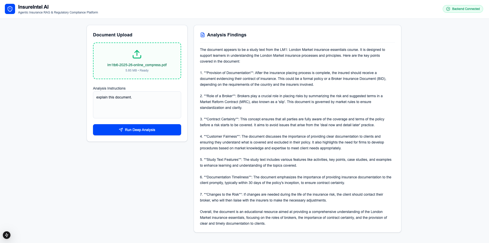

# 🛡️ InsureIntel AI: Agentic Document & Web RAG Engine

An intelligent, context-aware Generative AI copilot built specifically for the insurance sector. It ingests complex insurance policies, rider terms, and claim forms, delivers structural summaries, and autonomously queries the live web via OpenAI function calling to patch missing data, look up compliance codes, or verify regional regulatory changes.



## 🚀 Key Capabilities

* **Intelligent Document Ingestion:** Extracts raw context dynamically from complex PDFs and text documents using high-fidelity chunking.
* **Autonomous Fact-Checking:** Powered by `gpt-4o`, the agent reads between the lines. If a clause references external rules or market standards not explicitly listed in the file, it triggers a function call to resolve the data gap.
* **Agentic Web-Search Fallback:** Leverages the **Tavily AI Search API** via LangChain's `bind_tools` to find real-time answers for missing policy data or regulatory frameworks.
* **Context-Preserving Output:** Blends internal document context with external web intelligence without hallucinating clauses.

---

## 🏗️ System Architecture & Data Flow

The system operates on an advanced, tool-augmented **Retrieval-Augmented Generation (RAG)** loop using OpenAI's deterministic tool calling.

```text
[ User Uploads Document ] 
         │
         ▼
[ PDF Parser (PyPDF) ] ──> [ Extract & Chunk Text ]
                                      │
                                      ▼
                      [ OpenAI Agent Evaluates Request ]
                                      │
                    Is external context or regulation missing?
                     /                         \
                   YES                          NO
                   /                              \
   [ Call Tavily Search API ]             [ Generate Answer ]
                   │                              ▲
                   ▼                              │
         [ Merge Web Results + Doc Context ] ─────┘

```

---

## 💻 Tech Stack

* **Frontend:** Next.js, React, Tailwind CSS
* **Backend:** FastAPI, Python, Uvicorn
* **AI Orchestration:** LangChain, LangGraph
* **LLM:** OpenAI (`gpt-4o` or `gpt-4-turbo`)
* **Search Tooling:** Tavily API
* **Package Management:** `uv`

---

## 📂 Repository Structure

```text
insurance-ai-bot/
├── frontend/                    # Single-Page Application (Next.js & Tailwind)
│   ├── src/
│   │   ├── components/          # Interactive Chat Window & Drag-and-Drop modules
│   │   └── pages/               # Primary workspace view
│   └── package.json
│
└── backend/                     # Agentic API Orchestrator (FastAPI & Python)
    ├── app/
    │   ├── api/                 # Endpoint routing (/upload, /chat)
    │   ├── services/            # File parsers, chunking helpers
    │   └── agents/              # LangChain OpenAI orchestration & tool binding
    ├── requirements.txt         # Pinned packages locked down via `uv`
    └── main.py                  # API Runtime Entrypoint

```

---

## 🛠️ Local Development Quickstart

### 1. Backend Spin-Up (Using `uv`)

Ensure you have `uv` installed, then navigate to your backend directory to initialize your environment:

```bash
cd backend

# Create your isolated environment instantly with Python 3.11
uv venv --python 3.11

# Activate the virtual environment
# On macOS/Linux:
source .venv/bin/activate
# On Windows:
.venv\Scripts\activate

# Install the dependencies
uv pip install -r requirements.txt

```

### 2. Environment Setup

Create a `.env` file inside your `backend/` directory to configure your runtime API keys:

```env
OPENAI_API_KEY="sk-your-openai-api-key"
TAVILY_API_KEY="tvly-your-tavily-api-key"
HOST="127.0.0.1"
PORT=8000

```

### 3. Run the Development Server

With your environment variables declared and your virtual environment active, kick off the API service:

```bash
uvicorn main:app --reload

```

Your service will be active at `[http://127.0.0.1:8000](http://127.0.0.1:8000)`. You can browse your interactive API testing panel at `[http://127.0.0.1:8000/docs](http://127.0.0.1:8000/docs)`.

---

## 🛡️ Enterprise Security & Data Handling

* **Isolated Processing:** Uploaded payload contents are processed completely in-memory during the session.
* **Deterministic Tool Boundaries:** OpenAI function calling strictly governs when external API requests (Tavily) are made, preventing arbitrary data egress.
